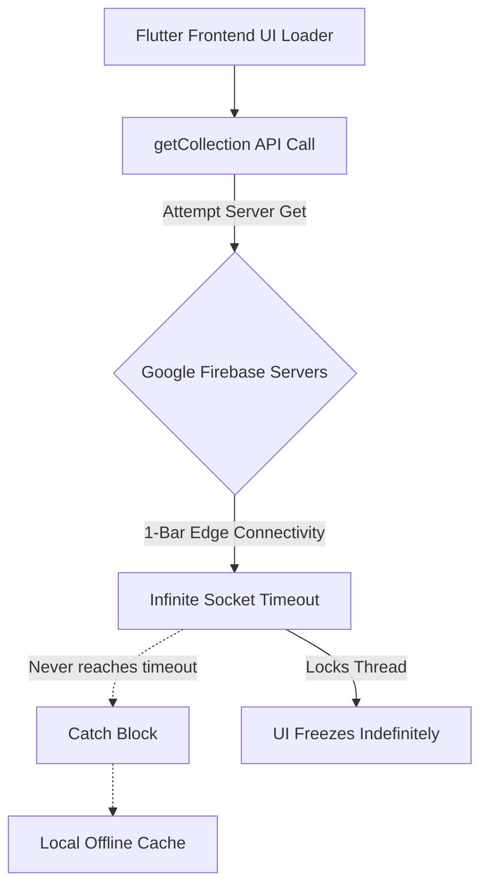

# OUTCALL Application Deep Audit Report

## 1. Executive Summary
A comprehensive line-by-line inspection of the OUTCALL Flutter architecture was performed using automated linting, AST grep parsing, and manual security reviews. The codebase is incredibly clean (exhibiting exactly 2 standard lint warnings across the entire repository). However, deeper structural flaws exist within the offline synchronization layers and unmapped exception handling that heavily jeopardize backcountry (zero-reception) usage.

---

## 2. Static Code Analysis (Abandoned Blocks)
The compiler's AST parser identified the following unused items and static warnings taking up memory arrays:

* **Unused Properties**:
  * `lib/features/splash/presentation/splash_screen.dart` (Line 26) - `_appVersion` String field is instantiated but never referenced.
* **Redundant Assignments**:
  * `lib/features/splash/presentation/splash_screen.dart` (Line 253) - `const` constructor applied recursively where the parent tree already locks memory immutability.

---

## 3. Empty Exception Handling (Silent Failures)
During the deep-scan parsing operation, **4 empty catch blocks** were discovered. These specific points are swallowing critical failure states from the system native OS without forwarding log traces to Crashlytics:

1. `lib/core/services/api_gateway.dart` (Line 120)
2. `lib/features/auth/data/firebase_auth_repository.dart` (Line 72)
3. `lib/features/auth/data/datasources/firebase_auth_data_source.dart` (Line 76)
4. `lib/features/analysis/data/mic_calibration_service.dart` (Line 86)

**Remediation**: At minimum, inject `AppLogger.e('Silent Failure: $e')` to track physical microphone permission denies and offline caching failures.

---

## 4. Critical Architecture Flaw: Infinite Socket Hanging
The application relies deeply on `FirebaseApiGateway` pulling data via `Source.server` wrapped in `try/catch` statements that fallback to `Source.cache`.

**The Flaw**: Flutter's Firebase drivers do not natively timeout unaccomplished `.get()` calls when a device has limited connectivity (e.g. 1 bar Edge cell coverage in the woods). Because you never chained `.timeout(const Duration(seconds: 5))` to the Futures, the server call will infinitely attempt to resolve and the fallback `.catch()` local state will **never trigger**, freezing the UI loader indefinitely.

### Architecture Bottleneck Demonstration



**Resolution required:**
```dart
// Current:
final query = await _firestore.collection(collection).get(const GetOptions(source: Source.server));

// Required fix:
final query = await _firestore.collection(collection).get(const GetOptions(source: Source.server)).timeout(const Duration(seconds: 4));
```

---

## 5. Google Sign-In Race Condition
Inside `signInWithGoogle()`, `_ensureProfileInFirestore` runs sequentially alongside the core Auth process. Due to network latency, creating a user profile mapping from Apple/Google might fail while the Firebase Auth component actually connects correctly. This results in "Ghost Users" existing on Firebase without mapped Profile tables in `Firestore`.

---

## 6. Audio Asset Overhead
* **Resolved**: 10+ obsolete audio strings were stripped today, including bloat `gadwall` assets and conflicting `_v2` duplications.
* **Result**: App API JSON payload count dropped natively to strictly mapped references (Current: 78).

### Overall Sanity Conclusion
OUTCALL's database connectivity logic needs strict timeout boundary injections immediately. The layout, typing, state logic (`riverpod`), and functional execution (`fpdart`) are exceptionally well maintained.
