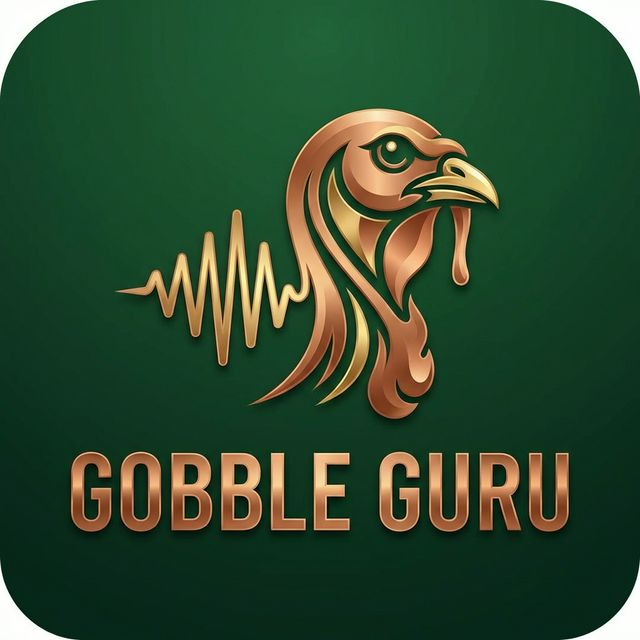

# 🦌 Hunting Calls Perfection


## 🎯 Master the Art of the Hunt

**Hunting Calls Perfection** is a high-performance Flutter application designed to help hunters refine their animal calling techniques through real-time audio analysis and feedback.

<p align="center">
  
</p>

## ✨ Key Features

- 🎙️ **Real-time Audio Recording**: High-fidelity capture (WAV PCM16) across Windows, Linux, Android, and iOS.
- 📉 **Frequency Analysis**: Live waveform and amplitude visualization for immediate feedback.
- 🏆 **Performance Scoring**: Advanced AI-driven comparison against reference master calls.
- 👤 **Hunter Profiles**: Track your progress over time with detailed call history and statistics.
- 🌓 **Dynamic Themes**: Seamless switching between light and dark modes for any environment.

## 🛠️ Built With

- **Flutter & Dart**: Cross-platform magic.
- **[record](https://pub.dev/packages/record)**: Native audio recording for all desktop and mobile platforms.
- **FFTEA**: Fast and precise frequency analysis.
- **Provider**: Streamlined state management.
- **Google Fonts**: Premium typography for a professional look.

## 🚀 Getting Started

### Prerequisites

- [Flutter SDK](https://docs.flutter.dev/get-started/install) (>= 3.0.0)
- Desktop or Mobile development environment

### Installation

1. **Clone the repository**
   ```bash
   git clone https://github.com/user/hunting_calls.git
   cd hunting_calls
   ```

2. **Install dependencies**
   ```bash
   flutter pub get
   ```

3. **Run the app**
   ```bash
   flutter run
   ```

## 📸 Screenshots

*(Screenshots coming soon!)*

## 📄 License

This project is licensed under the MIT License - see the [LICENSE](LICENSE) file for details.

---
<p align="center">
  Made with ❤️ for the great outdoors.
</p>
